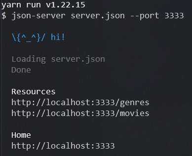

<div align="center" id="top"> 
  

&#xa0;

</div>

<h1 align="center">WatchMe</h1>
<h2 align="center">Desafio 02 - Trilha ReactJS</h2>

<p align="center">
  

  

  

  

</p>

<p align="center">
  <a href="#dart-sobre">Sobre</a> &#xa0; | &#xa0; 
  <a href="#sparkles-funcionalidades">Funcionalidades</a> &#xa0; | &#xa0;
  <a href="#rocket-tecnologias">Tecnologias</a> &#xa0; | &#xa0;
  <a href="#checkered_flag-começando">Começando</a> &#xa0; | &#xa0;
  <a href="#film_strip-demonstração">Demo</a> &#xa0; | &#xa0;
  <a href="#memo-licença">Licença</a> &#xa0; | &#xa0;
  <a href="https://github.com/cleber-santos" target="_blank">Autor</a>
</p>

<br>

## :dart: Sobre

No segundo desafio do chapter 1 da trilha ReactJs, o principal objetivo era de refatorar uma página para listagem de filmes de acordo com gênero.

A aplicação já estava totalmente funcional mas grande parte do seu código está diretamente no arquivo `App.tsx`. Para resolver isso da melhor forma, era necessário dividir a aplicação em duas partes principais: sidebar e o conteúdo principal que possui o header e a listagem de filmes.

- A aplicação possui apenas uma funcionalidade principal que é a listagem de filmes;
- Na sidebar é possível selecionar qual categoria de filmes deve ser listada (Ação, Comédia, etc);
- A primeira categoria da lista ("Ação") já deve começar como marcada;
- O header da aplicação possui apenas o nome da categoria selecionada que deve mudar dinamicamente.

## :sparkles: Funcionalidades

:heavy_check_mark: Listar os filmes por gênero;\
:heavy_check_mark: Mostrar na tela a capa dos filmes listados, conforme o gênero;\

## :rocket: Tecnologias

As seguintes ferramentas foram usadas na construção do projeto:

- [React](https://pt-br.reactjs.org/)
- [Webpack](https://webpack.js.org/)
- [Sass](https://sass-lang.com/)
- [Babel](https://babeljs.io/)
- [TypeScript](https://www.typescriptlang.org/)
- [Jest](https://jestjs.io/pt-BR/)

## :white_check_mark: Pré requisitos

Antes de começar :checkered_flag:, você precisa ter o [Git](https://git-scm.com) e o [Yarn](https://yarnpkg.com/) instalados em sua maquina.

## :checkered_flag: Começando

```bash
# Clone este repositório
$ git clone https://github.com/cleber-santos/watchme

# Entre na pasta
$ cd watchme

# Instale as dependências
$ yarn

# Para iniciar o projeto
$ yarn dev

# O app vai inicializar em <http://localhost:8080>

```

Navegue até a pasta criada, abra no Visual Studio Code e execute os seguintes comandos no terminal, vamos utilizar agora o JSON Server para simular uma API que possui as informações de gêneros e filmes:

```bash
yarn server
```

Em seguida, você vai ver a mensagem:



# :film_strip: Demonstração


## :memo: Licença

Este projeto está sob licença MIT. Veja o arquivo [LICENSE](LICENSE) para mais detalhes.

Feito com :heart: por <a href="https://github.com/cleber-santos" target="_blank">Cleber Santos</a>

&#xa0;

<a href="#top">Voltar para o topo</a>
